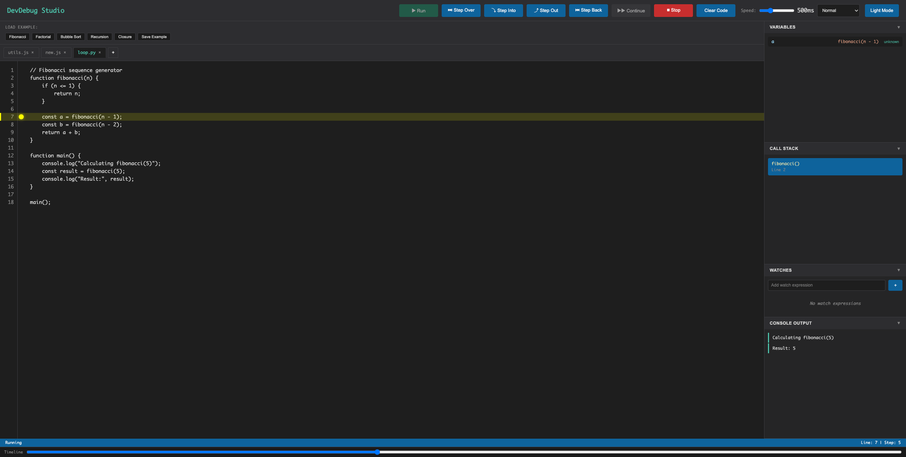

# DevDebug Studio

DevDebug Studio is a browser‑based JavaScript step debugger that lets you run code, step through execution, set breakpoints (including conditional), inspect variables and the call stack, and watch expressions live. It’s a single‑page app with a VS‑Code‑style interface, example loader, timeline scrubber, and light/dark themes—built to make understanding program flow visual and interactive.



## Files
- `index.html` – App markup
- `styles.css` – App styling (themes, layout, panels, editor)
- `script.js` – Debugger simulation logic and UI behavior
- `images/devdebugv2.png` – README screenshot

## Run
Open `index.html` in a browser. Note: it loads Acorn from a CDN, so an internet connection is required unless you bundle it locally.

If you want a local server:

```sh
python3 -m http.server
```

Then visit `http://localhost:8000`.

## How to Use
1. Click **Run** to start execution, or use **Step Over** / **Step Into** to move line by line.
2. Toggle breakpoints by clicking the gutter or line numbers; Alt/Meta‑click to add a condition.
3. Use **Continue** to resume after a breakpoint and **Stop** to reset.
4. Add watch expressions in the Watches panel to track values over time.
5. Edit variable values by double‑clicking them in the Variables panel.
6. Use the Timeline scrubber or **Step Back** to revisit prior steps.
7. Switch files with tabs, add new tabs with `+`, or clear the current tab with **Clear Code**.
8. Toggle Light/Dark mode with the theme button; your preference is saved.

## How It Works
1. **Step list generation**: The app parses JavaScript with Acorn and builds a list of executable lines.
2. **Stepping**: Each step highlights the active line and updates the UI panels.
3. **Breakpoints**: Click the gutter or line numbers to toggle breakpoints. Alt/Meta‑click adds a conditional breakpoint.
4. **State panels**: Variables, call stack, watches, and console output refresh after each step.
5. **Persistence**: Code, tabs, breakpoints, watches, and theme are saved to localStorage.
6. **Timeline**: The scrubber lets you jump back to a previously recorded step.

## Features
- Run / step controls (step over, step into, step out, step back, continue) with adjustable speed
- Breakpoints (click line numbers or gutter)
- Step back and timeline scrubber
- Watches panel with expressions
- Variable panel with editable values
- Example loader + save custom examples
- Multiple file tabs with close buttons
- Clear Code button for the active tab
- Light/Dark mode toggle (saved to localStorage)
