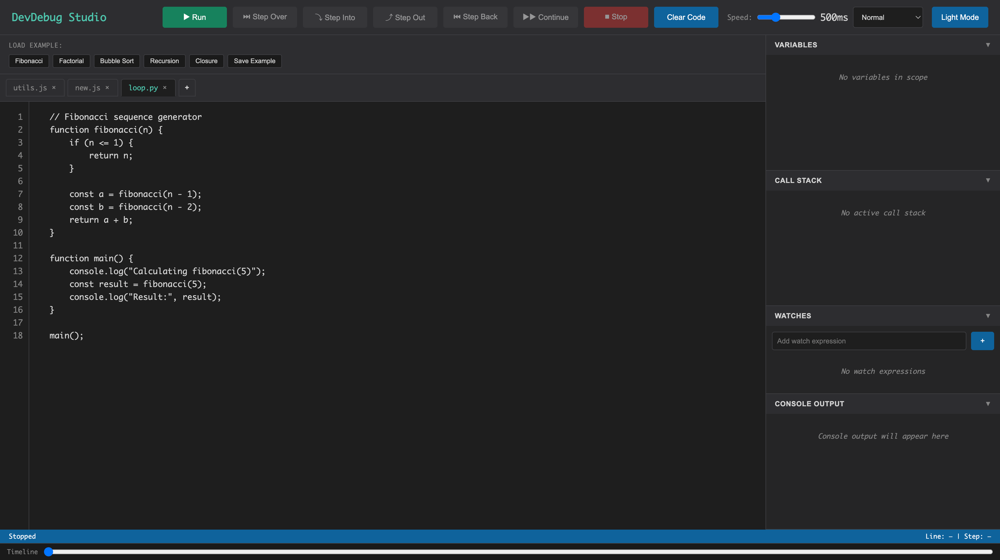

# DevDebug Studio

DevDebug Studio is a browser‑based JavaScript step debugger that lets you run code, step through execution, set breakpoints, inspect variables and the call stack, and watch expressions live. It’s a single‑page app with a VS‑Code‑style interface, example loader, timeline scrubber, and light/dark themes—built to make understanding program flow visual and interactive.



## Files
- `index.html` – App markup
- `styles.css` – Styling
- `script.js` – Debugger simulation logic

## Run
Open `index.html` in a browser.

If you want a local server:

```sh
python3 -m http.server
```

Then visit `http://localhost:8000`.

## Features
- Run / step controls with adjustable speed
- Breakpoints (click line numbers or gutter)
- Step back and timeline scrubber
- Watches panel with expressions
- Variable panel with editable values
- Example loader + save custom examples
- Multiple file tabs with close buttons
- Clear Code button for the active tab
- Light/Dark mode toggle (saved to localStorage)
